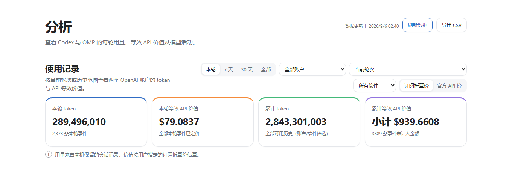
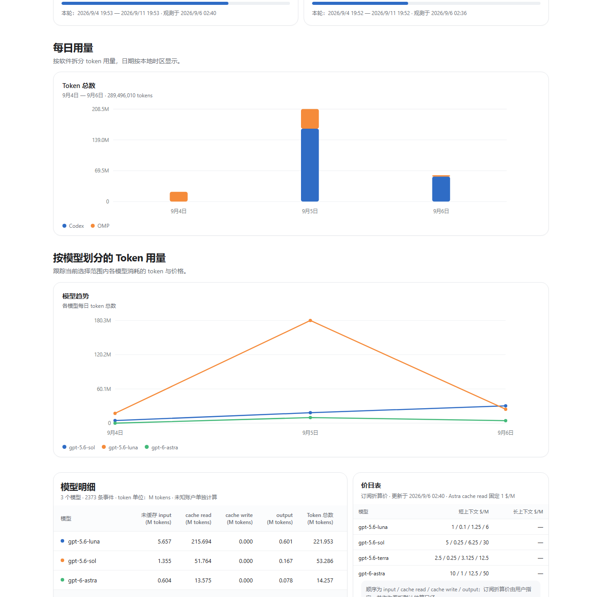
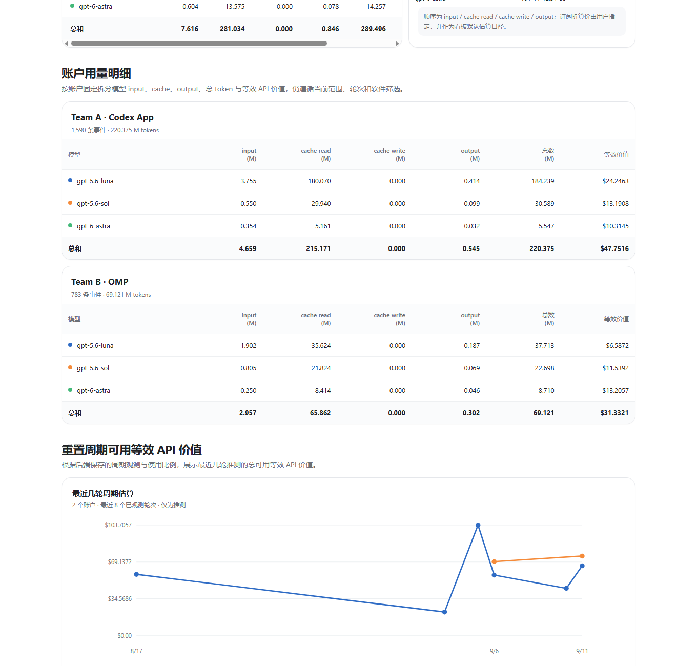
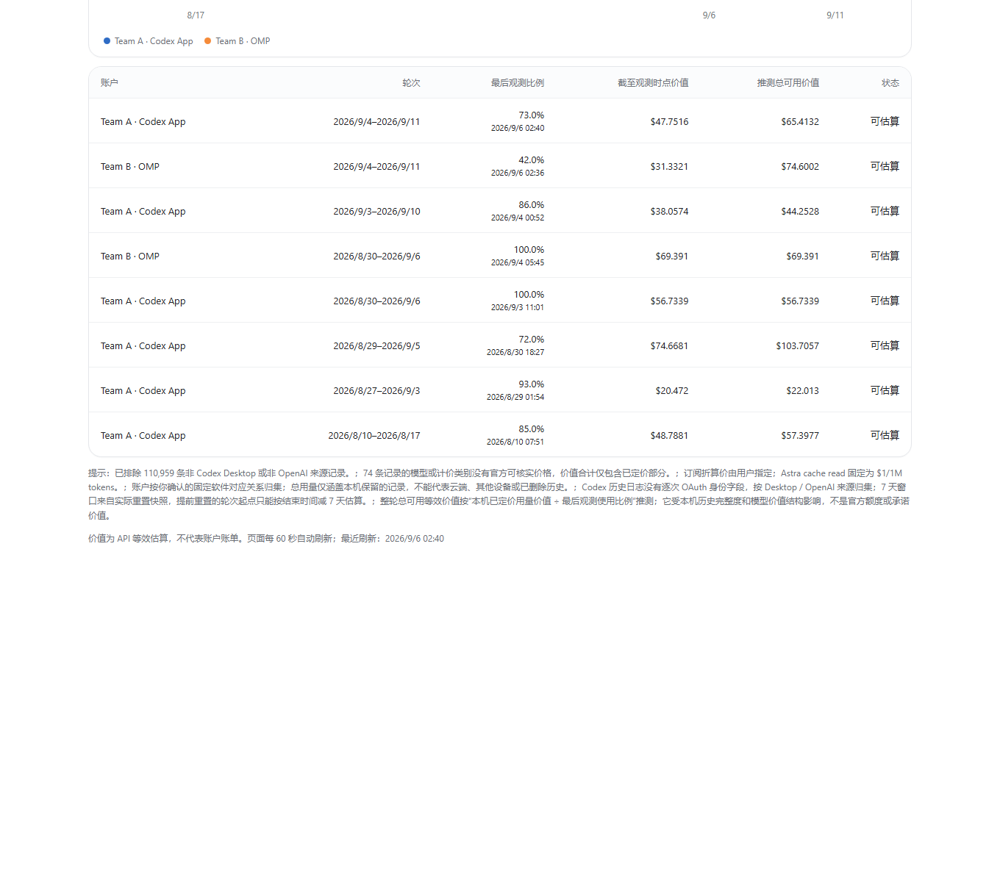

# Codex + OMP 本地用量看板

一个只在本机运行的 Codex App + [OMP](https://github.com/can1357/oh-my-pi) 用量分析看板。它读取两个固定 Team 账户的本地会话记录与 OAuth 7 天配额快照，按模型拆分 token、订阅折算价和官方 API 价，并估算每轮重置周期的总可用等效价值。

本项目是社区工具，与 OpenAI 无隶属或官方合作关系。

   [](https://github.com/dude1wudv/codex-omp-usage-dashboard/releases)

## 界面预览

下面的截图来自实际运行中的本地前端；数值会随本机日志、账户配额和当前筛选条件变化。

### 概览与价格口径



### 每日用量与模型趋势



### 两个账户的独立模型明细



### 重置周期总可用等效 API 价值



早期的简洁预览仍保留在 [assets/dashboard-preview.png](assets/dashboard-preview.png)，方便快速查看整体风格。

## 一键启动

适用于 Windows 10/11，需要安装 Python 3.10 或更高版本，并已登录 Codex App 和 OMP。

1. 下载或克隆本仓库。
2. 双击 `Start.cmd`。
3. 浏览器会自动打开 <http://127.0.0.1:8766>。

运行 `Install-DesktopShortcut.ps1` 可在桌面创建 `Codex OMP Usage Dashboard` 快捷方式。运行 `Stop.ps1` 可停止后台服务。

也可以在 PowerShell 中启动：

```powershell
python server.py
```

项目只使用 Python 标准库，无需 `pip install`。

## 看板内容

- 两个账户各自的 7 天使用比例、重置时间和观测时间。
- 本轮与本机累计 Token、按模型拆分的等效 API 价值及总和。
- 每日用量、模型趋势图和鼠标悬停详情。
- 总和模型明细以及两个账户各自的独立明细，Token 表格使用 M 为单位。
- 最近已观测重置周期的总可用等效 API 价值推测、折线图和数据表。
- 当前 OpenAI Standard 价目表中的 GPT-5.5、GPT-5.6 系列和 GPT-6 系列。
- “订阅折算价 / 官方 API 价”一键切换；默认使用订阅折算价，卡片、账户明细、周期推测和 CSV 会同步使用所选口径。
- 本轮、最近 7 天、30 天、全部历史、账户、软件和历史轮次筛选，以及 CSV 导出。

### 默认账户映射

看板按你的本地使用方式固定映射：Codex App 对应一个 Team 账户，OMP 对应另一个 Team 账户。程序不会根据日志正文猜测身份；首次绑定后如果 OAuth 登录身份变化，会保留旧历史并提示核对。

账户默认显示为 `Team A · Codex App` 和 `Team B · OMP`，可修改 `config.json` 中的 `labels`。

默认数据目录是 `~/.codex` 和 `~/.omp/agent`。需要自定义时，在 `config.json` 中增加 `codexRoot` 或 `ompRoot`；`ompRoot` 应指向同时包含 `agent.db` 与 `sessions` 的 OMP agent 目录。

## 数据来源与统计口径

Codex 数据来自 `~/.codex/sessions` 与 `~/.codex/archived_sessions`，只纳入 Codex Desktop / OpenAI 来源。OMP 数据来自 `~/.omp/agent/sessions` 中 `openai-codex` 的 assistant 用量；额度历史来自 OMP 的只读 `agent.db`。

美元等效价值按以下公式重估：

```text
(非缓存输入 × 输入单价
 + 缓存读取 × 缓存单价
 + 缓存写入 × 写入单价
 + 输出 × 输出单价) / 1,000,000
```

官方 API 价对照项来自 [OpenAI 官方 Standard API 价格](https://developers.openai.com/api/docs/pricing)；适用模型单次请求超过 272,000 输入 Token 时使用官方长上下文价格。输出已经包含 reasoning，不重复相加。历史会按当前选择的价格口径重估，因此结果是比较指标，不是订阅扣款或实际 API 账单。未知模型或缺失计费类别显示“待定”。

看板默认使用用户指定的“订阅折算价”。该口径基于订阅内模型权重可能尚未随 API 降价同步调整的假设，并非 OpenAI 公布的订阅扣费价格。单位均为 USD / 1M tokens：

| 模型 | input | output | cache write | cache read |
| --- | ---: | ---: | ---: | ---: |
| GPT-5.6 Luna | 1 | 6 | 1.25 | 0.1 |
| GPT-5.6 Terra | 2.5 | 12.5 | 3.125 | 0.25 |
| GPT-5.6 Sol | 5 | 30 | 6.25 | 0.25 |
| GPT-6 Astra | 10 | 50 | 12.5 | 1 |

Astra 的 cache read 固定为 1 USD / 1M tokens。

整轮总可用等效价值推测公式：

```text
从轮次起点到最后配额观测时刻的本机已定价等效价值
÷ 同一时刻的使用比例
```

缺少配额快照、比例为 0、没有本机事件或事件全部无法定价时不会生成推测。该指标受模型组合、缓存比例、观测时点与本机历史完整度影响，不代表固定美元额度。

累计数据只代表本机仍保留的日志，不包含云端、其他设备或已删除历史。Codex 历史日志没有逐次 OAuth 身份字段，归属依据固定的“Codex App 一个账户、OMP 另一个账户”使用方式。首次绑定后如登录身份变化，程序会提示，不自动把旧历史迁移给新账户。

## 隐私与安全

- 服务只监听 `127.0.0.1`，拒绝非本机 Host，不开放 CORS。
- 前端只收到脱敏账户哈希和数字用量，不包含消息正文、邮箱或 OAuth token。
- 当前 OAuth access token 只在内存读取，仅用于访问 OpenAI 的 `https://chatgpt.com/backend-api/wham/usage` 额度接口；程序不会修改、刷新或保存凭据。
- 缓存、账户绑定和历史快照保存在 `%LOCALAPPDATA%\CodexOmpUsageDashboard`，不写入仓库。

## 测试

```powershell
python -m unittest discover -p "test_*.py" -v
python server.py --snapshot
```

第二条命令会扫描本机数据并输出不含凭据和消息正文的安全汇总。

供自动化编码 Agent 使用的部署步骤见 [AI_DEPLOY.md](AI_DEPLOY.md)。

## 最新发布

当前稳定版本：[v1.0.0](https://github.com/dude1wudv/codex-omp-usage-dashboard/releases/tag/v1.0.0)。该版本包含订阅折算价作为默认口径、官方 API 价对照、账户明细上下排列、悬停图表提示、周期估算图表、CSV 导出和 Windows 桌面快捷方式支持。

## License

[MIT](LICENSE)
